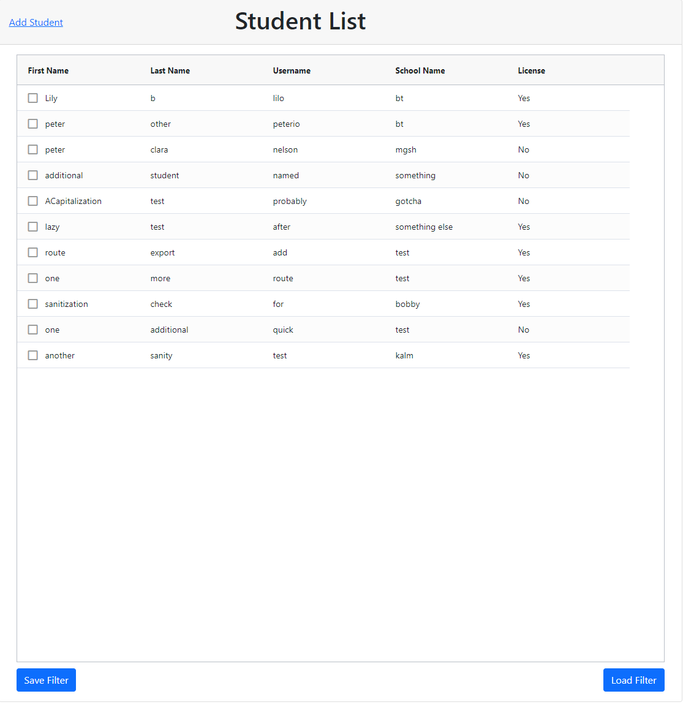
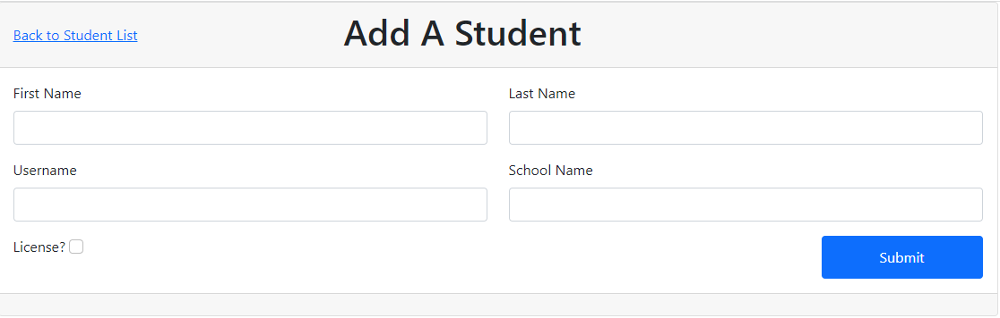

# Getting Started with Read Naturally Student List Grid App

This project was bootstrapped with [Create React App](https://github.com/facebook/create-react-app). But then I changed the build to use vanilla webpack/babel.

## Available Scripts

In the project directory, you can run:

### `npm run dev` && `npm run start-server`

`npm run dev` starts the frontend React app serving to port 8080 (i.e. localhost:8080/student-grid)

`npm run start-server` starts the backend Express service on port 3001. You can verify this is working by opening `http://localhost:3001/student-list` in a web browser.

**NOTE: the MySQL database must also be running on your machine to run this. I have this set up as a Windows service. The setup for this goes beyond the scope of this readme, but a vanilla install of MySQL with a database configured as expected in /server/index.js is all that's required**

# Student Grid Page

* DISCLAIMER: I AM NOT A UX DESIGNER AND IT SHOWS. PLEASE SEND HELP.
* Click on any field in the grid to edit, EXCEPT:
* Click on a `Username` cell to open a modal showing a photo of the student (hardcoded to a single image for this demo).
* Click on a column name to sort/filter based on the values in that column.
* Sorts are persisted across sessions automatically using local storage.
* Filters can be manually saved/loaded using the buttons below the grid (also in local storage).
* Delete rows from the grid by selecting a row (checkbox on the left edge of the row) and pressing delete on your keyboard (this really needs some kind of UI hint or additional element).

# Add Student Form

* Straightforward form - fill in the fields and press Submit, which redirects back to the Student List Page
* Several glaring issues remaining here:
  * ZERO validation on any of the form fields (yikes).
  * ZERO error handling (i.e. what if the POST to add the student fails?).
  * If a user enters some values but doesn't submit, and then tries to navigate away, should probably present a confirmation dialog...
* There should probably be an option to include a photo? Otherwise it's unclear where the photo modal on the grid page would get its data.
